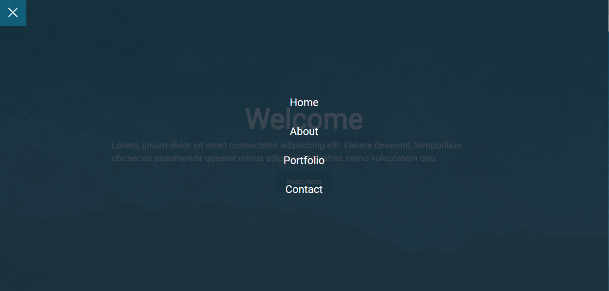

# hamburguer-menu
Hamburguer Menu feito só com CSS

## Como usar: 
O arquivo menu.css contém todo o processo necessário. Só é preciso importar para o seu projeto e utilizar as classes conforme a estrutura do html.

